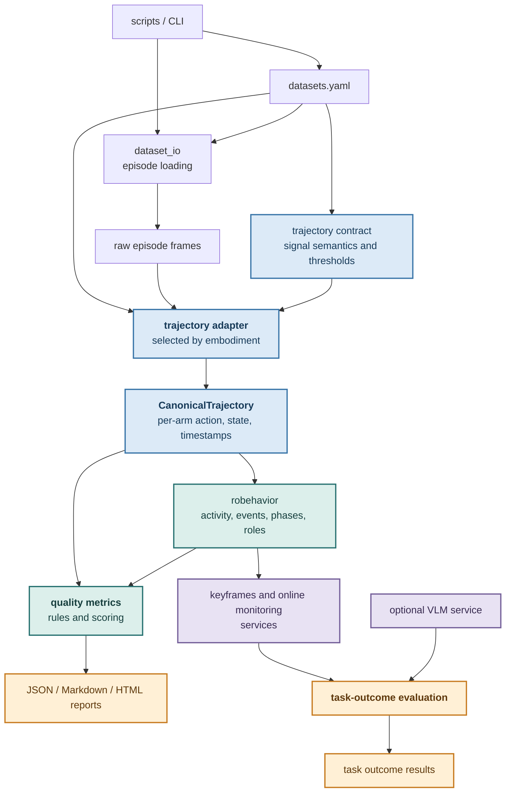

# Robot Demonstration Analysis Toolkit

Tools for analyzing robot demonstrations through trajectory normalization,
behavior and quality assessment, task-outcome evaluation, keyframe extraction,
and optional Qwen-VL review. The toolkit supports both offline episode
analysis and incremental online monitoring.

## Background

Assessing the quality of real-world teleoperation data is not simply a matter
of mapping an action sequence to a single score. There is no universal metric
that captures whether every demonstration is correct, useful for learning, and
physically meaningful. The assessment must account for three sources of
context:

- **Task dependence.** Success criteria and the required level of temporal
  detail vary by task. For a short task such as pressing a bell, verifying the
  final outcome may be sufficient. A longer task such as arranging multiple
  objects may require checks at intermediate stages to distinguish successful
  progress from a coincidentally plausible final state.
- **Embodiment dependence.** The same motion has different significance across
  robot configurations and arm roles. In a bimanual demonstration, for
  example, scoring the motion quality of an arm that is merely passive can
  produce a number without providing useful evidence about the demonstrated
  skill.
- **Action-contract dependence.** Robot datasets may encode commands and state
  in joint space, end-effector space, or embodiment-specific layouts. Position,
  orientation, gripper, and timing fields must be interpreted according to an
  explicit contract before physically meaningful metrics can be derived or
  compared.

This toolkit therefore starts from the robot embodiment and trajectory
contract rather than from a fixed global score. Its modular analysis layers
separate signal normalization, behavior interpretation, quality metrics, and
task-specific outcome evaluation. Configuration interfaces and optional VLM
judges support custom task criteria, while quality and task dashboards plus an
online replay GUI support practical dataset review and filtering workflows.

## Architecture

The current architecture is centered on a canonical trajectory shared by
behavior and quality analysis:



Blue nodes are trajectory representations. Teal nodes are analysis stages.
Purple nodes are services. Amber nodes are user-facing outputs or
result-producing stages.

`trajectory/` owns embodiment selection, contract parsing, and conversion of
raw arrays into `CanonicalTrajectory`. `robehavior/` owns behavioral inference,
including moving-arm activity, phases, roles, keyframe selection, and online
monitoring. `quality/` consumes
the canonical trajectory plus behavior context to produce learning metrics,
diagnostics, scores, and reports. VLM integration is optional and consumes
selected keyframes; it is not part of trajectory parsing or quality scoring.

Files under `scripts/` are command-line entry points and experiment runners.
Library code does not import from `scripts/`. `robehavior` accepts injected
judges instead of importing a concrete VLM. LeRobot, Hugging Face, and model
imports are delayed until their services are used, so contract, event, and
metric modules can be imported without those optional runtimes installed.

### Robot Behavior Modules

| Module | Responsibility |
| --- | --- |
| `robehavior/activity.py` | Measures per-arm activity from canonical action/state signals, labels quiet/passive/active intensity, builds active intervals, and infers the moving arm. It does not assign task phases or arm roles. |
| `robehavior/events.py` | Defines the lightweight `Event` and `EventTimeline` data structures used to represent detected behavior events. It does not detect events itself. |
| `robehavior/phases.py` | Segments each arm into behavior phases such as `grasp`, `transport`, `release`, `retreat`, `manipulate`, and `idle`, then converts phase boundaries into event timelines. |
| `robehavior/roles.py` | Infers per-arm roles (`actor`, `support`, `passive`, or `idle`) from activity and phase timelines. |
| `robehavior/profile.py` | Provides the offline analysis entry point by composing activity analysis, phase segmentation, and role inference into one `BehaviorProfile`. |
| `robehavior/keyframes.py` | Consumes phase-boundary events, resolves keyframe specifications, applies image-selection policies, and saves keyframe images and JSON metadata. It does not independently detect phases. |
| `robehavior/online_monitor.py` | Runs the independent streaming state machine, including incremental command, fully-open, retreat, image-buffer, and alert handling. |
| `robehavior/registry.py` | Resolves episode cameras from the inferred moving arm and the embodiment adapter. |
| `robehavior/__init__.py` | Exposes the supported package-level activity, phase, role, and behavior-profile APIs. |

The offline behavior path is:

```text
CanonicalTrajectory -> activity -> phases -> phase events -> keyframes
                                  \-> roles
```

The streaming path is intentionally separate:

```text
stream samples -> online monitor -> online events and alerts
```

Offline phases prefer measured gripper state over action commands. For example,
`near_target` means that the measured state is within the contract-defined
tolerance of the calibrated open or closed value; it is not a visual judgment.
Visual confirmation remains an optional VLM or image-evaluation concern.

### Quality Modules

| Module | Responsibility |
| --- | --- |
| `quality/metrics.py` | Implements pure numerical trajectory metrics, including path length, rotation statistics, log dimensionless jerk, trajectory efficiency, hesitation, gripper chatter, and timestamp quality. It does not assign flags or scores. |
| `quality/rules.py` | Converts learning-quality metrics into the overall score and generic flags such as `jerky`, `inefficient`, and `hesitant`. |
| `quality/contextual_rules.py` | Parses dataset-specific behavior expectations and compares observed phase and role timelines with those expectations to produce structured findings. |
| `quality/evaluator.py` | Runs behavior analysis for one canonical trajectory, selects task-active movement, computes per-arm metrics, applies rules, and aggregates episode and dataset results. |
| `quality/pipeline.py` | Provides dataset-level entry points: loads episodes, builds canonical trajectories through the embodiment adapter, invokes the evaluator, and optionally writes JSON. |
| `quality/results.py` | Defines `TimestampQuality`, `QualityFinding`, `EpisodeQuality`, and `QualityReport`, including JSON serialization and compact output formatting. |
| `quality/review.py` | Converts reports to Markdown and pandas tables, summarizes metric distributions, and ranks suspicious episodes for manual review. |
| `quality/dashboard.py` | Builds the self-contained Plotly HTML dashboard, including score distributions, diagnostics, cross-metric plots, labels, and the review queue. |
| `quality/__init__.py` | Exposes the supported quality analysis, result, review, Markdown, and HTML APIs. |

The quality-analysis path is:

```text
dataset episode -> trajectory adapter -> CanonicalTrajectory
                                         |-> robehavior profile
                                         |-> numerical metrics
behavior context + metrics -> rules and contextual findings
                           -> EpisodeQuality -> QualityReport
                           -> JSON / Markdown / HTML / review table
```

`metrics.py` only measures signals. Generic score thresholds belong to
`rules.py`, while task-specific expected behavior belongs to
`contextual_rules.py`. Diagnostic metrics such as path length and timestamp
jitter are reported for review but do not automatically contribute to the
overall score.

## Data Quality Evaluation

Demonstration quality is evaluated in two stages. The stages answer different
questions and should not be collapsed into one score.

### 1. Validity and Task Success

An episode must first be usable and successful:

- Validity checks whether required signals, timestamps, dimensions, cameras,
  and trajectory-contract fields are present and internally consistent.
- Task success checks whether the demonstrated task actually reached its
  intended outcome. Proprioceptive signals can establish behavior boundaries,
  but they cannot always prove scene-level outcomes such as whether an object
  is upright or inside a shelf compartment.
- VLM question answering over selected keyframes provides the optional visual
  task-success judgment. This result is a gate, not a motion-quality metric.

An invalid or unsuccessful episode should be rejected or reviewed before its
motion-quality score is used for training selection. A smooth failed
demonstration is still a failed demonstration.

### 2. Non-Visual Demonstration Quality

Episodes that pass the first stage are evaluated from action, state, and
timestamp signals. The embodiment adapter and trajectory contract define arm
layout, action space, action mode, rotation representation, gripper semantics,
units, and sampling rate before any metric is computed. This prevents, for
example, treating delta actions as absolute poses or binary gripper commands as
measured actuator chatter.

Behavior analysis then identifies task-active arms and phases. Only transitions
whose role is `actor` or `support`, and whose phase represents task movement,
contribute to learning-quality metrics. Passive or idle arms do not receive an
artificially poor score.

| Metric | Signal and scope | Purpose | In overall score |
| --- | --- | --- | --- |
| `translation_smoothness` | Absolute end-effector action position over task-movement segments | Negative log dimensionless jerk; larger values indicate smoother commanded Cartesian motion | 35% |
| `trajectory_efficiency` | Absolute end-effector action position, computed per movement segment | Compares direct displacement with traveled path | 35% |
| `hesitation_fraction` | Absolute end-effector action position over task movement | Measures the fraction of low-speed movement transitions | 20% |
| `joint_smoothness` | Observed joint state over task-movement segments | Negative log dimensionless jerk of executed joint motion | 10% |
| `gripper_chatter_rate` | Non-binary gripper action over task-active intervals | Detects repeated gripper reversals; binary commands are excluded | No |
| `translation_path_length` | Absolute end-effector action position | Describes commanded Cartesian travel | No |
| `joint_path_length` | Observed joint state | Describes executed joint travel | No |
| `rotation_path_length` | Absolute end-effector action orientation | Describes accumulated angular travel | No |
| `angular_speed_mean` | Absolute end-effector action orientation | Describes average angular speed | No |
| `angular_acceleration_rms` | Absolute end-effector action orientation | Describes rotational acceleration variation | No |
| `jitter_ratio` | Episode timestamps | Describes sampling regularity | No |

The four weighted learning metrics produce an arm score from 0 to 10. All four
must be available; weights are not silently redistributed when a metric is not
applicable. Episode scores average the scored task-active arms, and dataset
scores average scored episodes. Diagnostic metrics remain available for
distribution review and outlier ranking without changing the score.

Dataset-specific behavior expectations are evaluated separately from the
generic score. They compare observed phase and role timelines with explicit
rules in `datasets.yaml` and produce findings such as `unexpected_static` or
`unexpected_role`.

### Reference Percentile Calibration

Generic quality flags use fixed engineering heuristics. A known-good reference
set can additionally initialize dataset-relative thresholds: P5 for metrics
where lower values are worse (`translation_smoothness`, `joint_smoothness`,
and `trajectory_efficiency`) and P95 for `hesitation_fraction`, where higher
values are worse. Calibration is computed per arm and requires 20 valid,
task-active values per metric by default.

The reference episode list must contain episodes already accepted by validity
and task-success review. Calibration does not infer success, change the 0-10
score, or replace generic flags. Its `reference_*` flags are added only when a
calibration file is explicitly loaded, so they mean outside this dataset's
known-good distribution rather than universally bad.

## Metric Definitions and Applicability

In each `per_arm` result, metrics are grouped by purpose. `learning_quality`
contains metrics useful for demonstration filtering or weighting, while
`diagnostics` contains descriptive motion and sampling measurements. The arm's
`overall_score`, applicability metadata, and role status remain at the arm
level.

| Output | Source | Requirement and interpretation |
| --- | --- | --- |
| `translation_smoothness`, `translation_path_length` | end-effector action position | Requires `action.space: end_effector` and `action.mode: absolute`. These describe command-space motion, not measured execution. |
| `rotation_path_length`, `angular_speed_mean`, `angular_acceleration_rms` | end-effector action orientation | Also requires an absolute action and a declared rotation representation. Quaternion values use the configured component order. |
| `joint_smoothness`, `joint_path_length` | observed joint state | Requires joint positions in `state`; these describe executed joint motion. |
| `trajectory_efficiency`, `hesitation_fraction` | end-effector action position | Computed separately over task movement phases, then aggregated. Phase boundaries prevent approach, transport, and retreat from being treated as one point-to-point path. |
| `gripper_chatter_rate` | gripper action | Not reported for `binary_command`: normal grasp and release commands are intentional state changes, not actuator chatter. |
| `jitter_ratio` | timestamps | Describes sampling regularity and is independent of arm kinematics. |

`translation_smoothness` is the negative logarithm of dimensionless jerk for
the end-effector position signal:

```text
velocity     = gradient(position, dt)
acceleration = gradient(velocity, dt)
jerk         = gradient(acceleration, dt)
jerk_energy  = sum(jerk^2) * dt

translation_smoothness = -log(T^3 / peak_velocity^2 * jerk_energy)
```

Here, `T` is the segment duration and `peak_velocity` is the maximum
translation-speed norm in that segment. Negative values are expected: the
quantity inside the logarithm is commonly greater than one. A larger value
(closer to zero, or positive) indicates smoother motion, while a more negative
value indicates stronger jerk. For example, `-12.96` is smoother than `-25`.
The current generic rule flags values below `-25` as `jerky`.

Smoothness is computed independently for each included movement segment and
then averaged using segment frame counts as weights. At least four position
samples are required; stationary or zero-duration segments do not produce a
value. Because numerical third derivatives amplify sampling noise, smoothness
should be compared only across data with consistent sampling and preprocessing.
`joint_smoothness` uses the same definition on observed joint positions.

Only transitions whose role is `actor` or `support` contribute to task-quality
metrics. Within those intervals, motion metrics use the
`unclassified_motion`, `transport`, `retreat`, and `manipulate` phases;
single-transition `grasp` and `release` events split adjacent motion segments.
An arm containing only `passive` or `idle` roles has no arm score and does not
contribute to the episode score.

`overall_score` is the arm's fixed-weight learning-quality score:

```text
overall_score = 10 * (0.35 * S_translation
                    + 0.35 * trajectory_efficiency
                    + 0.20 * (1 - hesitation_fraction)
                    + 0.10 * S_joint)
```

`S_translation` and `S_joint` map log dimensionless jerk to `[0, 1]` with
`1 / (1 + exp(-(smoothness + 18) / 4))`; larger values indicate smoother
motion. All four components are required. If any component is unavailable, the
arm has no `overall_score` rather than silently redistributing its weight.
Timestamp jitter, path lengths, angular diagnostics, and gripper chatter do not
affect this score.

Scores produced from different action spaces or different available signals
should not be compared unless all four components are available under the same
metric definitions. For contracts with `coordinate_frame: unknown`, geometric
metrics remain useful within one episode if the frame is stable, but absolute
paths should not be compared across robots or datasets.

## Quick Start

### 1. Task Success

Task-success evaluation extracts behavior keyframes and optionally sends them
to Qwen-VL for a visual outcome judgment. Use the individual steps when
debugging keyframe selection or prompts, or use the end-to-end workflow for
dataset evaluation.

#### Extract Keyframes

Event-driven keyframes select frames around meaningful behavior boundaries,
which makes them more useful for checking task outcomes than uniformly
sampling an entire episode. `robehavior/events.py` defines the event timeline
data model, `robehavior/phases.py` derives grasp, release, and retreat boundary
events from behavior phases, and `robehavior/keyframes.py` maps those events to
predefined frame-selection policies. The selected frames can then be reviewed
directly or passed to VLM evaluation.

The `--keyframes` option supports these event types:

| Keyframe | Meaning | Implementation |
| --- | --- | --- |
| `episode_start` | First frame of the episode. | Episode boundary in `robehavior/keyframes.py`. |
| `pre_grasp` | Frame offset before the detected grasp start. | `grasp_start` from `robehavior/phases.py`; offset policy in `robehavior/keyframes.py`. |
| `gripper_close` | Detected gripper-closing event. | `grasp_start` from `robehavior/phases.py`; mapping in `robehavior/keyframes.py`. |
| `post_grasp` | Frame offset after the detected grasp start. | `grasp_start` from `robehavior/phases.py`; offset policy in `robehavior/keyframes.py`. |
| `pre_place` | Frame offset before the detected release start. | `release_start` from `robehavior/phases.py`; offset policy in `robehavior/keyframes.py`. |
| `gripper_open` | Detected gripper-opening event. | `release_start` from `robehavior/phases.py`; mapping in `robehavior/keyframes.py`. |
| `post_place` | Frame offset after the detected release start. | `release_start` from `robehavior/phases.py`; offset policy in `robehavior/keyframes.py`. |
| `episode_end` | Last frame of the episode. | Episode boundary in `robehavior/keyframes.py`. |
| `gripper_fully_open` | First configured open-value match after release starts. | Signal-based detection in `robehavior/keyframes.py`. |
| `release_keyframe` | Latest fully-open, stationary frame before retreat. | Signal-based detection in `robehavior/keyframes.py`. |
| `pre_retreat` | Frame offset before the detected retreat start. | `retreat_start` from `robehavior/phases.py`; offset policy in `robehavior/keyframes.py`. |
| `retreat_start` | Detected retreat-phase boundary. | Event from `robehavior/phases.py`; mapping in `robehavior/keyframes.py`. |
| `post_retreat` | Frame offset after the detected retreat start. | `retreat_start` from `robehavior/phases.py`; offset policy in `robehavior/keyframes.py`. |

The default set is `episode_start`, `pre_grasp`, `gripper_close`, `post_grasp`,
`pre_place`, `gripper_open`, `post_place`, and `episode_end`. The `pre_*` and
`post_*` frames use `--offset`, which defaults to 5 frames. The
`gripper_fully_open` and `release_keyframe` events require resolvable gripper
open/closed semantics; `release_keyframe` also requires a position signal for
the stationary check. A supported event that is not detected in an episode is
skipped, while an unknown keyframe name raises `ValueError`. The CLI wiring is
implemented in `scripts/extract_keyframes.py`.

Extract one episode's keyframes:

```bash
python3.12 scripts/extract_keyframes.py \
  --dataset DSRFM_easy \
  --episode 0 \
  --keyframes episode_start \
  --camera observation.images.camera_1 \
  --camera observation.images.camera_2 \
  --out <keyframe-output-dir>
```

#### Run VLM on Extracted Keyframes

Use `--prompt-mode qa` with `--question` for free-form questions about selected
frames. The `--question` argument is required in `qa` mode:

```bash
python3.12 vlm/qwen_vl_qa.py \
  --keyframe-dir <keyframe-output-dir>/DSRFM_easy/ep_000 \
  --prompt-mode qa \
  --question "Is the cylindrical object upright?" \
  --camera observation.images.camera_1 \
  --keyframes episode_end \
  --max-new-tokens 120
```

Use `--prompt-mode` to select a predefined prompt when the task has a known
output contract. Predefined modes supply their own question and response
format, so `--question` is not required. For example,
`cylinder_upright` requests a structured upright-or-lying judgment:

```bash
python3.12 vlm/qwen_vl_qa.py \
  --keyframe-dir <keyframe-output-dir>/DSRFM_easy/ep_000 \
  --prompt-mode cylinder_upright \
  --shot-mode fewshot \
  --camera observation.images.camera_1 \
  --keyframes episode_start \
  --max-new-tokens 120
```

Supported prompt modes are:

- `qa`: free-form question answering over selected keyframes.
- `success_judge`: task-level success judgment.
- `cylinder_upright`: structured JSON judgment for upright vs non-upright
  cylinder placement.
- `shelf_placement_after_release`: structured JSON judgment for whether the
  released object is inside the shelf compartment.

#### Evaluate Task Outcomes

Evaluate task outcomes for one episode:

```bash
python3.12 scripts/evaluate_task_outcomes.py \
  --dataset DSRFM_v3 \
  --episode 0 \
  --keyframes episode_start \
  --prompt-mode cylinder_upright \
  --shot-mode fewshot \
  --camera observation.images.camera_1 \
  --max-new-tokens 120
```

Evaluate task outcomes for all episodes:

```bash
python3.12 scripts/evaluate_task_outcomes.py \
  --dataset DSRFM_easy \
  --keyframes episode_start \
  --prompt-mode cylinder_upright \
  --shot-mode fewshot \
  --camera observation.images.camera_1 \
  --max-new-tokens 120
```

For shelf placement, the default keyframes are `gripper_open` and
`gripper_fully_open`. With top and left cameras, Qwen-VL receives four images
per episode:

```bash
python3.12 scripts/evaluate_task_outcomes.py \
  --dataset DEM_pickplace \
  --prompt-mode shelf_placement_after_release \
  --shot-mode zeroshot \
  --keyframe-out outputs/keyframes_all_eps \
  --camera observation.images.camera_top \
  --camera observation.images.camera_left
```

`cylinder_upright` returns structured JSON such as:

```json
{
  "is_upright": true,
  "confidence": "high"
}
```

`shelf_placement_after_release` returns structured JSON such as:

```json
{
  "placement_status": "inside",
  "confidence": 0.95
}
```

#### Task Outcome Outputs

When `--output-json`, `--output-txt`, and `--output-html` are omitted,
`scripts/evaluate_task_outcomes.py` generates timestamped names containing the
dataset, keyframe type, prompt mode, shot mode, and episode scope. Typical
outputs are:

- `outputs/qwenvl/DSRFM_v3/episode_start_cylinder_upright_fewshot_ep000_<timestamp>.json`
- `outputs/result/DSRFM_v3_episode_start_cylinder_upright_fewshot_ep000_<timestamp>_summary.txt`
- `outputs/result/DSRFM_v3_episode_start_cylinder_upright_fewshot_ep000_<timestamp>_summary.html`

The model is loaded once and reused across episodes. The summary text includes
the run time and per-episode inference timing. The self-contained HTML dashboard
shows task-success KPIs, an episode outcome strip, model confidence, and a
manual-review queue. Convert an older summary without rerunning the model with:

```bash
python3.12 scripts/visualize_task_outcomes.py \
  --input outputs/task_valid/<summary>.txt \
  --dataset DEM_pickplace
```


### 2. Non-Visual Demonstration Quality

This stage evaluates canonical action, state, gripper, and timestamp signals.
It does not use camera images or VLM judgments.

#### Analyze Quality

Analyze trajectory quality for a quick sample:

```bash
python3.12 scripts/analyze_quality.py \
  --dataset DEM_pickplace \
  --sample 10
```

For a 10-episode workflow test using a specific Python environment, write
timestamped results to `tmp/` with fish:

```fish
set timestamp (date +%Y%m%d_%H%M%S)
<python-executable> \
  scripts/analyze_quality.py \
  --dataset DEM_pickplace \
  --sample 10 \
  --output tmp/DEM_pickplace_quality_$timestamp.json
```

Omit `--sample` to analyze all episodes, or add `--min-score 6` for a nonzero
exit status when the dataset falls below a required score.

To initialize P5/P95 thresholds, put accepted episode IDs in a JSON list or a
newline-delimited text file, then generate a calibration from the analyzed
reference episodes:

```bash
python3.12 scripts/analyze_quality.py \
  --dataset DEM_pickplace \
  --reference-episodes good_episodes.json \
  --write-calibration outputs/quality/DEM_pickplace_calibration.json
```

Apply those dataset-relative thresholds in a later run:

```bash
python3.12 scripts/analyze_quality.py \
  --dataset DEM_pickplace \
  --calibration outputs/quality/DEM_pickplace_calibration.json
```

Use `--lower-quantile`, `--upper-quantile`, and `--min-reference-count` to
override the P5/P95 defaults and minimum sample size.

#### Quality Reports

Each run writes three files with the same timestamp: the `.json` file contains
the complete per-episode results, the `.md` file contains the dataset-level
metric summary and manual-review priority, and the self-contained `.html`
dashboard provides interactive learning-quality plots, diagnostic
distributions, cross-metric comparison, and a sortable review queue. The HTML
dashboard requires Plotly in the analysis environment (`python -m pip install
plotly`) when it is generated, but can be opened without a server or network
connection afterward. Without `--output`, all three timestamped files are
written under `outputs/quality/`. Raw vectors
first pass through the dataset's action/state contract and become synchronized
per-arm translation, orientation, joint, and gripper signals. Translation and
joint smoothness are reported separately. Quaternion rotation uses geodesic
angular distance, so `q` and `-q` are treated as the same orientation. Metrics
are computed only when their semantic requirements are met: current Cartesian
path and smoothness metrics require absolute end-effector actions, while a
delta-action dataset reports those metrics under `not_applicable` instead of
treating delta commands as absolute poses.

#### HTML Quality Dashboard

The following example shows the overview from a generated 10-episode sample
report:


Open the generated `.html` file directly in a browser; no local server is
required. For example:

```fish
xdg-open tmp/DEM_pickplace_quality_<timestamp>.html
```

The dashboard contains:

- **Dataset overview**: score distribution and score by episode. Flagged
  episodes are red, and the dashed line is the dataset median.
- **Learning quality**: translation smoothness, joint smoothness, trajectory
  efficiency, and hesitation fraction. These metrics contribute to filtering
  and `overall_score`; the hesitation plot also shows its flag threshold.
- **Diagnostic distributions**: path lengths, angular motion, and timestamp
  jitter. The shaded region is P10-P90 and the dashed line is the median.
  These values provide context and do not contribute to `overall_score`.
- **Cross-metric view**: trajectory efficiency versus translation smoothness,
  colored by hesitation fraction.
- **Review queue**: an episode table sortable by clicking its column headers.

Points outside the P10-P90 interval are labeled with their episode IDs. In the
cross-metric view, an episode is labeled when any displayed learning metric is
outside that interval. These labels indicate distribution tails, not automatic
quality failures; absolute rule failures are reported separately as flags.
Review-status selections in the HTML are temporary browser state and are not
written back to the JSON or dataset.

#### Behavior Summary

Each episode report contains a compact `behavior_summary`, grouped by arm. For
example, DEM pick-and-place episode 000 produces:

```json
"behavior_summary": {
  "left": {
    "activity_score_mean": 0.87,
    "relative_activity_mean": 0.19,
    "passive_ratio": 0.66,
    "behaviorally_active_ratio": 0.07
  },
  "right": {
    "activity_score_mean": 5.05,
    "relative_activity_mean": 1.0,
    "passive_ratio": 0.0,
    "behaviorally_active_ratio": 1.0
  }
}
```

The fields mean:

- `activity_score_mean`: mean absolute activity intensity over the episode. At
  each transition, translation speed, angular speed, joint speed, and gripper
  change are divided by their thresholds from the trajectory contract, clipped
  to 10, averaged with equal weight over available channels, and smoothed over
  0.5 seconds. A value around 1 means the combined motion is near the configured
  activity scale; it is not a probability and may be greater than 1.
- `relative_activity_mean`: mean activity relative to the strongest arm at the
  same time, in `[0, 1]`. A value near 1 indicates that the arm is usually the
  dominant mover. A smaller value indicates weaker accompanying motion.
- `passive_ratio`: fraction of transitions classified as `passive`. This covers
  observable motion that does not satisfy both the absolute and relative
  thresholds for the `active` intensity class.
- `behaviorally_active_ratio`: fraction of transitions classified as `active`
  by absolute and relative activity. It measures candidate behavioral activity,
  rather than whether the measured motion is exactly zero; task grounding is
  applied separately when inferring the arm's role.

The activity classes use these current thresholds:

```text
quiet:   activity_score < 0.5
active:  activity_score >= 1.0 and relative_activity >= 0.5
passive: everything between those cases
```

The 0.5-second smoothing window is converted to frames using episode timestamps.
If timestamps are missing, the adapter constructs them from
`sampling.frequency_hz` in the trajectory contract. For a 10 Hz dataset, the
window is 5 frames; for a 20 Hz dataset, it is 10 frames.

The summary should be read together with `phases` and `roles`. Continuous
activity alone does not prove semantic progress such as approaching an object.
Task phases such as `grasp`, `transport`, `release`, and `retreat` provide that
additional evidence. In the example above, the left arm moves, but its low
relative activity and lack of task phases classify it as passive; the right arm
is the task actor.

Quality assessment is split into generic measurements and task-aware
interpretation. The behavior layer first derives per-arm activity, phases, and
observed roles from the canonical trajectory. A static arm is descriptive, not
a failure, unless the dataset entry declares an explicit expectation. For
example:

```yaml
quality:
  behavior_expectations:
    - when: {arm: left, phase: transport}
      expect: {arm: right, role: support}
      severity: error
```

This rule emits an `unexpected_static` or `unexpected_role` finding only during
the matching left-arm transport intervals. Supported phases are `idle`,
`unclassified_motion`, `grasp`, `transport`, `release`, `retreat`, and
`manipulate`; supported roles are `actor`, `support`, `passive`, and `idle`.

## Online Monitoring and GUI

Online monitoring is separate from the two offline evaluation stages above. It
processes synchronized stream samples incrementally and can be run either as a
batch stream analyzer or through a local replay GUI.

### Analyze a Monitor Stream

Run the online-style failure monitor on a JSONL stream:

```bash
python3.12 scripts/analyze_monitor_stream.py \
  --dataset DEM_pickplace \
  --input-jsonl <stream-jsonl> \
  --prompt-mode shelf_placement_after_release \
  --camera observation.images.camera_top \
  --camera observation.images.camera_left \
  --output-json outputs/result/online_alerts.json \
  --output-txt outputs/result/online_events.txt
```

Each JSONL line should be one synchronized sample with action/state arrays and
camera image paths, for example:

```json
{
  "episode_index": 0,
  "frame_index": 105,
  "timestamp": 10.5,
  "action": [0.0, 0.0, 0.0, 0.0, 0.0, 0.0, 0.0, 0.0, 0.0, 0.0, 0.0, 0.0, 0.0, 0.0, 1.0, 1.0],
  "observation.state": [0.0, 0.0, 0.0, 0.0, 0.0, 0.0, 0.0, 0.0, 0.0, 0.0, 0.0, 0.0, 0.0, 0.0, 0.8, 0.8],
  "images": {
    "observation.images.camera_top": "<top-image-path>",
    "observation.images.camera_left": "<left-image-path>"
  }
}
```

The online monitor keeps a short rolling buffer and emits a compact event log
containing:

- `right_arm_start_to_place`
- `gripper_open`
- `gripper_fully_open`
- `object_in_shelf_status`
- `release_retreat_start`

It also emits alerts when `object_in_shelf_status` is `still_held`,
`dropped_outside`, `missed_compartment`, or `uncertain`.

### Replay in the Browser GUI

To generate a pseudo-online stream from an existing episode for testing:

```bash
python3.12 scripts/tools/export_online_stream.py \
  --dataset DEM_pickplace \
  --episode 0 \
  --camera observation.images.camera_top \
  --camera observation.images.camera_left \
  --output-dir outputs/online_stream_demo \
  --overwrite
```

To replay that stream in a local browser GUI with images plus live event and
alert descriptions:

```bash
python3.12 scripts/replay_monitor_stream.py \
  --dataset DEM_pickplace \
  --input-jsonl outputs/online_stream_demo/ep_000.jsonl \
  --camera observation.images.camera_top \
  --camera observation.images.camera_left \
  --port 8765
```

## Dataset Registry

Current dataset names in `datasets.yaml` include:

- `DSRFM_easy`
- `DSRFM_v3`
- `DEM_handposition`
- `DEM_pickplace`

The large local dataset folders are intentionally ignored by git:

- `data_DEM/`
- `data_DSRFM/`

Few-shot annotation assets are stored separately under
`data_anno/upstraight_labeling/`; this is not a registered LeRobot dataset.
The default upright example is `data_anno/upstraight_labeling/upstraight.jpg`,
and non-upright examples are loaded from
`data_anno/upstraight_labeling/lying/`. A single image or directory can be used
to override either demo source.

Generated outputs are also ignored:

- `outputs/keyframes/`
- `outputs/qwenvl/`
- `outputs/result/`

Then open `http://127.0.0.1:8765` in a browser. The page starts paused; `Play`
or `Step` advances the pseudo-online stream while accumulating events and
alerts.
