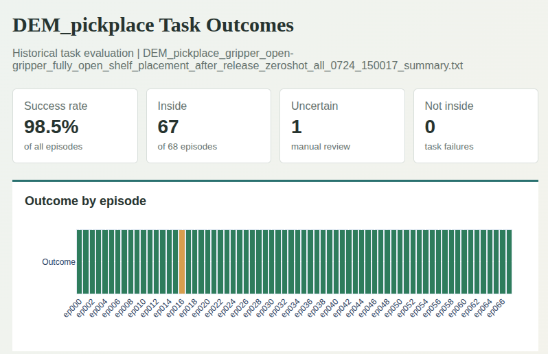
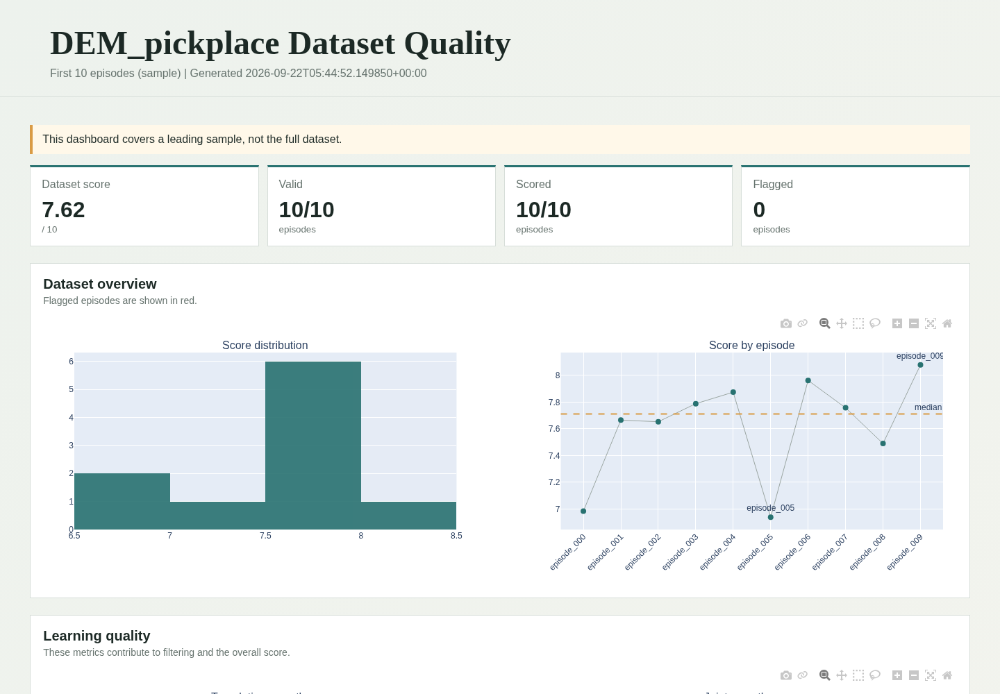
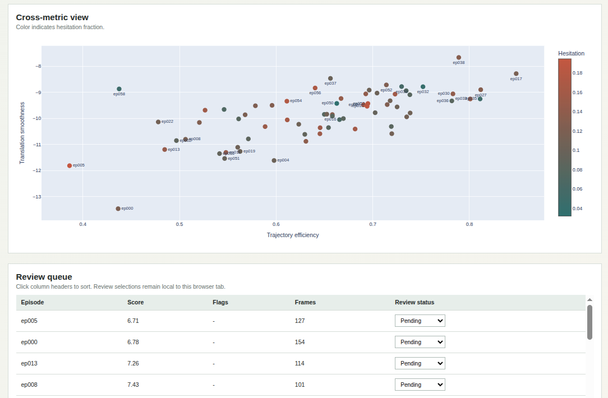

# Robot Demonstration Analysis Toolkit

Tools for analyzing robot demonstrations through trajectory normalization,
behavior and quality assessment, task-outcome evaluation, keyframe extraction,
and optional Qwen-VL review. The toolkit supports both offline episode
analysis and incremental online monitoring.

<table width="100%" cellpadding="0" cellspacing="0" style="table-layout: fixed; border-collapse: collapse;">
  <tr>
    <td align="center" width="50%" style="padding: 0; vertical-align: top;">
      
    </td>
    <td align="center" width="50%" style="padding: 0; vertical-align: top;">
      
    </td>
  </tr>
</table>

## Background

Assessing the quality of real-world teleoperation data is not simply a matter
of mapping an action sequence to a single score. There is no universal metric
that captures whether every demonstration is correct, useful for learning, and
physically meaningful. The assessment must account for three sources of
context:

- **Task dependence.** Success criteria and the required level of temporal
  detail vary by task. For a short task such as pressing a bell, verifying the
  final outcome may be sufficient. A longer task such as arranging multiple
  objects may require checks at intermediate stages to distinguish successful
  progress from a coincidentally plausible final state.
- **Embodiment dependence.** The same motion has different significance across
  robot configurations and arm roles. In a bimanual demonstration, for
  example, scoring the motion quality of an arm that is merely passive can
  produce a number without providing useful evidence about the demonstrated
  skill.
- **Action-contract dependence.** Robot datasets may encode commands and state
  in joint space, end-effector space, or embodiment-specific layouts. Position,
  orientation, gripper, and timing fields must be interpreted according to an
  explicit contract before physically meaningful metrics can be derived or
  compared.

This toolkit therefore starts from the robot embodiment and trajectory
contract rather than from a fixed global score. Its modular analysis layers
separate signal normalization, behavior interpretation, quality metrics, and
task-specific outcome evaluation. Configuration interfaces and optional VLM
judges support custom task criteria, while quality and task dashboards plus an
online replay GUI support practical dataset review and filtering workflows.

<p align="center">
  
</p>

## Architecture

The toolkit normalizes raw episodes into a shared `CanonicalTrajectory` before
behavior interpretation and quality evaluation. The full data flow, module
boundaries, optional services, and dependency rules are documented in
[`docs/architecture.md`](docs/architecture.md).

Package Documentation

- [`robehavior/README.md`](robehavior/README.md): behavior activity, phases,
  roles, keyframes, and online monitoring.
- [`quality/README.md`](quality/README.md): quality metrics, scoring rules,
  contextual findings, reports, and metric applicability.

At a high level, `robehavior` derives observable behavior context from the
canonical trajectory, while `quality` combines that context with contract-aware
metrics and task-specific rules. Both packages are designed to be used through
the shared trajectory and dataset interfaces described above.

## Quick Start

### 1. Task Success

Task-success evaluation extracts behavior keyframes and optionally sends them
to Qwen-VL for a visual outcome judgment. Use the individual steps when
debugging keyframe selection or prompts, or use the end-to-end workflow for
dataset evaluation.

#### 1.1 Extract Keyframes

Event-driven keyframes select frames around meaningful behavior boundaries,
which makes them more useful for checking task outcomes than uniformly
sampling an entire episode. `robehavior/events.py` defines the event timeline
data model, `robehavior/phases.py` derives grasp, release, and retreat boundary
events from behavior phases, and `robehavior/keyframes.py` maps those events to
predefined frame-selection policies. The selected frames can then be reviewed
directly or passed to VLM evaluation.

The `--keyframes` option supports these event types:

| Keyframe | Meaning | Implementation |
| --- | --- | --- |
| `episode_start` | First frame of the episode. | Episode boundary in `robehavior/keyframes.py`. |
| `pre_grasp` | Frame offset before the detected grasp start. | `grasp_start` from `robehavior/phases.py`; offset policy in `robehavior/keyframes.py`. |
| `gripper_close` | Detected gripper-closing event. | `grasp_start` from `robehavior/phases.py`; mapping in `robehavior/keyframes.py`. |
| `post_grasp` | Frame offset after the detected grasp start. | `grasp_start` from `robehavior/phases.py`; offset policy in `robehavior/keyframes.py`. |
| `pre_place` | Frame offset before the detected release start. | `release_start` from `robehavior/phases.py`; offset policy in `robehavior/keyframes.py`. |
| `gripper_open` | Detected gripper-opening event. | `release_start` from `robehavior/phases.py`; mapping in `robehavior/keyframes.py`. |
| `post_place` | Frame offset after the detected release start. | `release_start` from `robehavior/phases.py`; offset policy in `robehavior/keyframes.py`. |
| `episode_end` | Last frame of the episode. | Episode boundary in `robehavior/keyframes.py`. |
| `gripper_fully_open` | First configured open-value match after release starts. | Signal-based detection in `robehavior/keyframes.py`. |
| `release_keyframe` | Latest fully-open, stationary frame before retreat. | Signal-based detection in `robehavior/keyframes.py`. |
| `pre_retreat` | Frame offset before the detected retreat start. | `retreat_start` from `robehavior/phases.py`; offset policy in `robehavior/keyframes.py`. |
| `retreat_start` | Detected retreat-phase boundary. | Event from `robehavior/phases.py`; mapping in `robehavior/keyframes.py`. |
| `post_retreat` | Frame offset after the detected retreat start. | `retreat_start` from `robehavior/phases.py`; offset policy in `robehavior/keyframes.py`. |

The default set is `episode_start`, `pre_grasp`, `gripper_close`, `post_grasp`,
`pre_place`, `gripper_open`, `post_place`, and `episode_end`. The `pre_*` and
`post_*` frames use `--offset`, which defaults to 5 frames. The
`gripper_fully_open` and `release_keyframe` events require resolvable gripper
open/closed semantics; `release_keyframe` also requires a position signal for
the stationary check. A supported event that is not detected in an episode is
skipped, while an unknown keyframe name raises `ValueError`. The CLI wiring is
implemented in `scripts/extract_keyframes.py`.

Extract one episode's keyframes:

```bash
python3.12 scripts/extract_keyframes.py \
  --dataset DSRFM_easy \
  --episode 0 \
  --keyframes episode_start \
  --camera observation.images.camera_1 \
  --camera observation.images.camera_2 \
  --out <keyframe-output-dir>
```

#### 1.2 Run VLM on Extracted Keyframes

Use `--prompt-mode qa` with `--question` for free-form questions about selected
frames. The `--question` argument is required in `qa` mode:

```bash
python3.12 vlm/qwen_vl_qa.py \
  --keyframe-dir <keyframe-output-dir>/DSRFM_easy/ep_000 \
  --prompt-mode qa \
  --question "Is the cylindrical object upright?" \
  --camera observation.images.camera_1 \
  --keyframes episode_start
```

For shelf placement, use the predefined
`shelf_placement_after_release` prompt with zero-shot visual evaluation:

```bash
python3.12 vlm/qwen_vl_qa.py \
  --keyframe-dir <keyframe-output-dir>/DEM_pickplace/ep_000 \
  --prompt-mode shelf_placement_after_release \
  --shot-mode zeroshot \
  --camera observation.images.camera_top \
  --camera observation.images.camera_left \
  --keyframes gripper_open \
  --keyframes gripper_fully_open
```

Use `--prompt-mode` to select a predefined prompt when the task has a known
output contract. Predefined modes supply their own question and response
format, so `--question` is not required. For example,
`cylinder_upright` requests a structured upright-or-lying judgment:

```bash
python3.12 vlm/qwen_vl_qa.py \
  --keyframe-dir <keyframe-output-dir>/DSRFM_easy/ep_000 \
  --prompt-mode cylinder_upright \
  --shot-mode fewshot \
  --camera observation.images.camera_1 \
  --keyframes episode_start
```

#### 1.3 Evaluate Task Outcomes

Evaluate task outcomes for one episode:

```bash
python3.12 scripts/evaluate_task_outcomes.py \
  --dataset DSRFM_v3 \
  --episode 0 \
  --keyframes episode_start \
  --prompt-mode cylinder_upright \
  --shot-mode fewshot \
  --camera observation.images.camera_1
```

To evaluate all episodes, omit the `--episode` argument.

For shelf placement, the default keyframes are `gripper_open` and
`gripper_fully_open`.

```bash
python3.12 scripts/evaluate_task_outcomes.py \
  --dataset DEM_pickplace \
  --prompt-mode shelf_placement_after_release \
  --shot-mode zeroshot \
  --camera observation.images.camera_top \
  --camera observation.images.camera_left
```

### 2. Non-Visual Demonstration Quality

This stage evaluates canonical action, state, gripper, and timestamp signals.
It does not use camera images or VLM judgments.

#### 2.1 Analyze Quality

Analyze a 10-episode sample; timestamped results are written under
`outputs/quality/` by default:

```bash
python3.12 \
  scripts/analyze_quality.py \
  --dataset DEM_pickplace \
  --sample 10
```

Omit `--sample` to analyze all episodes, or add `--min-score 6` for a nonzero
exit status when the dataset falls below a required score.

Each episode report contains a compact `behavior_summary`, grouped by arm. For
example, DEM pick-and-place episode 000 produces:

```json
"behavior_summary": {
  "left": {
    "activity_score_mean": 0.87,
    "relative_activity_mean": 0.19,
    "passive_ratio": 0.66,
    "behaviorally_active_ratio": 0.07
  },
  "right": {
    "activity_score_mean": 5.05,
    "relative_activity_mean": 1.0,
    "passive_ratio": 0.0,
    "behaviorally_active_ratio": 1.0
  }
}
```

The fields mean:

- `activity_score_mean`: mean absolute activity intensity over the episode. At
  each transition, translation speed, angular speed, joint speed, and gripper
  change are divided by their thresholds from the trajectory contract, clipped
  to 10, averaged with equal weight over available channels, and smoothed over
  0.5 seconds. A value around 1 means the combined motion is near the configured
  activity scale; it is not a probability and may be greater than 1.
- `relative_activity_mean`: mean activity relative to the strongest arm at the
  same time, in `[0, 1]`. A value near 1 indicates that the arm is usually the
  dominant mover. A smaller value indicates weaker accompanying motion.
- `passive_ratio`: fraction of transitions classified as `passive`. This covers
  observable motion that does not satisfy both the absolute and relative
  thresholds for the `active` intensity class.
- `behaviorally_active_ratio`: fraction of transitions classified as `active`
  by absolute and relative activity. It measures candidate behavioral activity,
  rather than whether the measured motion is exactly zero; task grounding is
  applied separately when inferring the arm's role.

#### 2.2 HTML Quality Dashboard

Generated HTML reports contain an overview of the evaluated episodes and the
following dashboard views:

- **Dataset overview**: score distribution and score by episode. Flagged
  episodes are red, and the dashed line is the dataset median.
- **Learning quality**: translation smoothness, joint smoothness, trajectory
  efficiency, and hesitation fraction. These metrics contribute to filtering
  and `overall_score`; the hesitation plot also shows its flag threshold.
- **Diagnostic distributions**: path lengths, angular motion, and timestamp
  jitter. The shaded region is P10-P90 and the dashed line is the median.
  These values provide context and do not contribute to `overall_score`.
- **Cross-metric view**: trajectory efficiency versus translation smoothness,
  colored by hesitation fraction.
- **Review queue**: an episode table sortable by clicking its column headers.

Points outside the P10-P90 interval are labeled with their episode IDs. In the
cross-metric view, an episode is labeled when any displayed learning metric is
outside that interval. These labels indicate distribution tails, not automatic
quality failures; absolute rule failures are reported separately as flags.
Review-status selections in the HTML are temporary browser state and are not
written back to the JSON or dataset.

## Online Monitoring and GUI

Online monitoring processes synchronized stream samples incrementally. Use the
stream analyzer for an existing JSONL stream, or replay an episode through the
local browser GUI.

### 1. Analyze a Stream

Analyze an existing JSONL stream and write event and alert logs:

```bash
python3.12 scripts/analyze_monitor_stream.py \
  --dataset DEM_pickplace \
  --input-jsonl <stream-jsonl> \
  --prompt-mode shelf_placement_after_release \
  --camera observation.images.camera_top \
  --camera observation.images.camera_left \
  --output-json outputs/result/online_alerts.json \
  --output-txt outputs/result/online_events.txt
```

The monitor keeps a short rolling buffer and emits events for
`right_arm_start_to_place`, `gripper_open`, `gripper_fully_open`,
`object_in_shelf_status`, and `release_retreat_start`. It emits alerts when
`object_in_shelf_status` is `still_held`, `dropped_outside`,
`missed_compartment`, or `uncertain`.

### 2. Replay an Episode

Generate a pseudo-online stream from an existing episode, then replay it in the
browser GUI:

```bash
python3.12 scripts/tools/export_online_stream.py \
  --dataset DEM_pickplace \
  --episode 0 \
  --camera observation.images.camera_top \
  --camera observation.images.camera_left \
  --output-dir outputs/online_stream_demo \
  --overwrite
```

Then run the replay GUI:

```bash
python3.12 scripts/replay_monitor_stream.py \
  --dataset DEM_pickplace \
  --input-jsonl outputs/online_stream_demo/ep_000.jsonl \
  --camera observation.images.camera_top \
  --camera observation.images.camera_left \
  --port 8765
```
