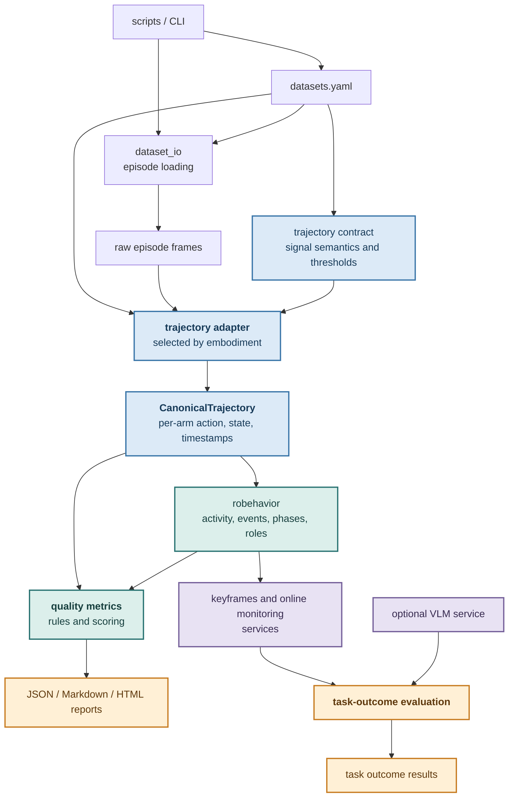

# Architecture

The toolkit is centered on a canonical trajectory shared by behavior and
quality analysis. Raw dataset episodes are normalized through an
embodiment-specific adapter and an explicit trajectory contract before any
behavior interpretation or quality metric is computed.

Blue nodes are trajectory representations. Teal nodes are analysis stages.
Purple nodes are services. Amber nodes are user-facing outputs or
result-producing stages.

## Module Boundaries

- `trajectory/` owns embodiment selection, contract parsing, and conversion of
  raw arrays into `CanonicalTrajectory`.
- `robehavior/` owns behavioral inference, including moving-arm activity,
  phases, roles, keyframe selection, and online monitoring.
- `quality/` consumes the canonical trajectory plus behavior context to produce
  learning metrics, diagnostics, scores, and reports.
- VLM integration is optional and consumes selected keyframes; it is not part
  of trajectory parsing or quality scoring.

Files under `scripts/` are command-line entry points and experiment runners.
Library code does not import from `scripts/`. `robehavior` accepts injected
judges instead of importing a concrete VLM. LeRobot, Hugging Face, and model
imports are delayed until their services are used, so contract, event, and
metric modules can be imported without those optional runtimes installed.

## Related Documentation

- [`robehavior/README.md`](../robehavior/README.md): behavior activity,
  phases, roles, keyframes, and online monitoring.
- [`quality/README.md`](../quality/README.md): quality metrics, scoring rules,
  contextual findings, reports, and metric applicability.
